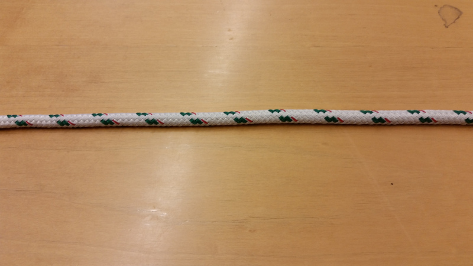
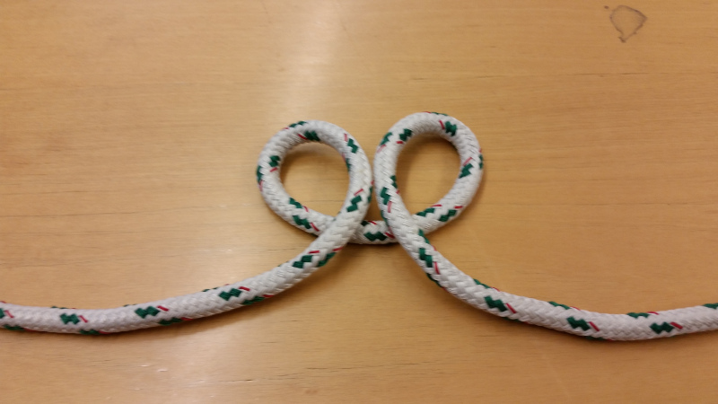
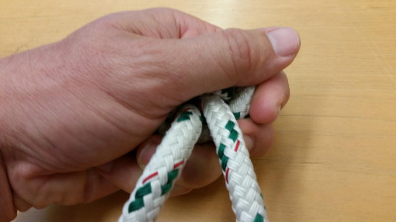

# Topper Stopper Knot

## Background

A boat I sail on has discussed tying a stopper knot in the topping
lift, so we can drop the spinaker pole to the right height without
having to look down at the line. Afterall, "head up" is always better
for boat awareness.

The knot cannot stay in the line permanently, as we need to remove it
to stow the spinnaker pole, so it must be fast and easy to tie and
untie.  Finally, the knot must go in the middle of a long line, unlike
the usual stopper knots that would go on an end, so it cannot require
feeding an end through something.

I based the following on the Ashley Stopper Knot, a personal favorite.

## Steps to tie

### Start

Begin with a piece of line. Here the right side would go to the clutch
or fairlead that the stopper will stop against, and the left side is
the free end.

### Make loops

Make a pair of loops pulling the two sides toward you and twisting in.
Both ends should be on the inside, and should cross above the middle
part.

### Feed right loop into left

Take the right side loop, the one that leads to the clutch or fairlead,
and feed it through the left side loop.

### Pull right loop tight

Hold the knot and pull on the right side loop until the left side loop
is tight and the right side loop is loose.

## Pull right side line tight

Pull on the right side line, the one that goes back to the clutch or
fairlead, until the knot is tight.

Once it is tight, you might pull on the left hand line, the one that
goes to the free end, to make sure it is tight too.

## Finished knot

When done, the finished knot should look like this.

# Untying

To untie, pull some slack from the line that goes to the clutch into
the loop that goes around the knot, which was the old right side loop.

Bring that loop back to the top of the knot.

Pull on the line that goes back to the clutch to pop the loop out.

